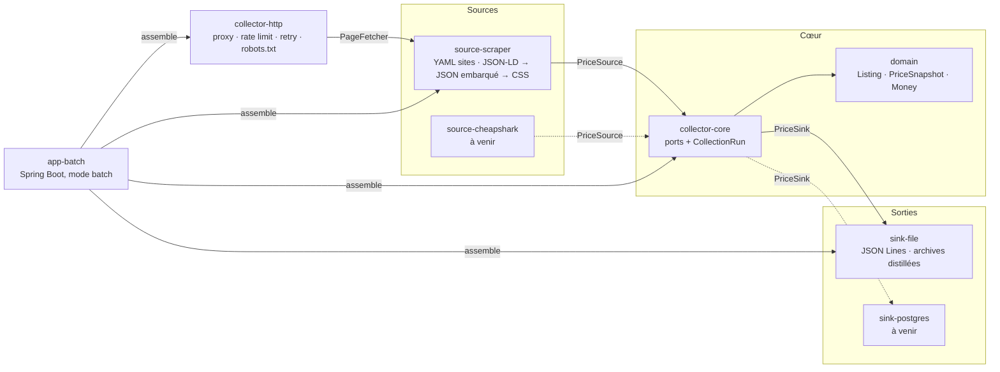

# Pricing Intel

Veille tarifaire multi-sources et moteur de recommandation de prix, appliqués aux jeux vidéo et aux composants PC.
Un produit, N sources, un historique fiable, puis un prix proposé selon la stratégie choisie, avec son explication.

État : **brique de collecte par scraping** livrée (ce dépôt). Viennent ensuite les sources API (jeux),
le stockage Postgres, l'analyse de marché, le moteur de stratégies et l'API de lecture.

Les choix d'architecture sont documentés dans [docs/adr](docs/adr/README.md), la démarche dans
[docs/philosophie.md](docs/philosophie.md).

## Architecture

Monolithe modulaire, ports et adaptateurs. Le domaine et le cœur ne connaissent aucun framework ;
les adaptateurs implémentent des ports ; seul le module d'application connaît Spring. Ces règles sont
vérifiées par ArchUnit à chaque build.



| Module               | Rôle                                                                                   | Dépend de        |
|----------------------|----------------------------------------------------------------------------------------|------------------|
| `domain`             | Modèle métier (records immuables)                                                      | JDK              |
| `collector-core`     | Ports `PriceSource`, `PriceSink`, `PageFetcher`, `RawSnapshotStore`, `ListingProvider` ; orchestration | `domain` |
| `collector-http`     | Client HTTP poli : `ProxyPolicy` (aucun / fixe / rotation), rate limit par hôte, retry avec backoff, robots.txt | `collector-core` |
| `source-scraper`     | Sites déclarés en YAML, chaîne d'extraction, parsing de prix FR/EN                     | `collector-core`, Jsoup, Jackson |
| `sink-file`          | Relevés en JSON Lines, archives de pages distillées (JSON + Markdown) ou HTML complet, rétention | `collector-core`, Jackson, Jsoup |
| `app-batch`          | Point d'entrée Spring Boot sans serveur web : configuration, assemblage, code de sortie | tout             |
| `architecture-tests` | Règles ArchUnit sur les frontières entre modules                                       | tout (test)      |

## Démarrer

Prérequis : JDK 21. Maven est fourni par le wrapper.

```bash
./mvnw verify
```

Puis déclarer les annonces à relever et lancer une collecte :

```bash
cp config/listings.example.yml config/listings.yml
```

```bash
./mvnw -q -DskipTests -pl app-batch -am package
```

```bash
java -jar app-batch/target/app-batch-0.1.0-SNAPSHOT-exec.jar
```

Par défaut la collecte affiche chaque relevé en console, l'ajoute à `data/releves.jsonl`, et archive une version
distillée de chaque page sous `data/raw/` (blocs JSON embarqués intacts + contenu visible en Markdown, quelques Ko,
rétention 180 jours ; le HTML complet est optionnel, rétention 7 jours, voir ADR 0014). Les archives expirées sont
purgées à la fin de chaque collecte. Le code de sortie vaut 1 si aucun relevé n'a pu être produit.

Sous Windows, remplacer `./mvnw` par `mvnw.cmd`.

### Lancer une brique seule

Toute la configuration est surchargeable en ligne de commande ou par variable d'environnement
(`COLLECTOR_PROXY_MODE=fixed`). Quelques exemples :

```bash
java -jar app-batch/target/app-batch-0.1.0-SNAPSHOT-exec.jar --collector.sinks.types=jsonl --collector.sinks.jsonl-file=./sortie.jsonl --collector.raw.enabled=false
```

```bash
java -jar app-batch/target/app-batch-0.1.0-SNAPSHOT-exec.jar --collector.proxy.mode=fixed --collector.proxy.host=proxy.interne --collector.proxy.port=3128
```

```bash
java -jar app-batch/target/app-batch-0.1.0-SNAPSHOT-exec.jar --collector.min-interval-per-host=10s --collector.sites.allow-unknown-hosts=false
```

Clés disponibles : voir [`application.yml`](app-batch/src/main/resources/application.yml).

## Déclarer un site

Un fichier YAML par site dans `config/sites/`. Les extracteurs sont essayés dans l'ordre ; le premier qui
trouve un prix gagne, et le relevé garde la méthode et sa confiance.

```yaml
id: ldlc
host: "*.ldlc.com"          # exact, *.domaine, ou * pour tout
extractors:
  - type: jsonld            # schema.org Product/Offer, sans paramètre
  - type: embedded-json     # état applicatif embarqué
    script: "script#__NEXT_DATA__"       # ou variable: window.__INITIAL_STATE__
    paths:
      price: /props/pageProps/product/price
      availability: /props/pageProps/product/stock/quantity
      gtin: /props/pageProps/product/ean
  - type: css               # dernier recours
    price: ".price"
    listPrice: ".price-old"
    availability: ".stock"
    title: "h1"
```

Un hôte sans définition est tenté avec le seul extracteur JSON-LD (désactivable). Une propriété inconnue dans
un YAML fait échouer le démarrage : les fautes de frappe se voient tout de suite.

## Ce qu'un relevé contient

Prix, prix barré, devise, disponibilité, état (neuf/occasion), type de vendeur, identité observée du produit
(GTIN, marque, référence fabricant, SKU, titre) pour le futur matching, méthode d'extraction et confiance,
URL finale et horodatage. Exemple d'une ligne de `releves.jsonl` :

```json
{"listingId":{"value":"ldlc-rtx4070s-msi-ventus"},"observedAt":"2026-09-05T08:00:12.418Z","observedUrl":"https://www.ldlc.com/fiche/PB00584657.html","price":{"amount":629.95,"currency":"EUR"},"availability":"IN_STOCK","condition":"NEW","sellerType":"UNKNOWN","identity":{"gtin":"4711377114363","brand":"MSI","sku":"PB00584657","title":"MSI GeForce RTX 4070 SUPER 12G VENTUS 2X OC"},"extraction":{"method":"jsonld","confidence":0.95}}
```

## Politesse et cadre d'usage

Un relevé par annonce et par jour, une requête toutes les trois secondes par hôte, User-Agent qui identifie
le projet, robots.txt respecté (y compris `Crawl-delay`), retry avec backoff sur erreur transitoire seulement,
pas de proxy par défaut, pas d'appel aux API internes des sites. Détails et raisonnement dans l'ADR 0006.

## Feuille de route

1. Source API pour les jeux (CheapShark, puis IsThereAnyDeal)
2. Sink Postgres (Supabase) et cron GitHub Actions actif
3. Analyse de marché : min, médiane, index, exclusion des hors-stock et des aberrants
4. Moteur de stratégies avec explication (alignement, undercut, index cible, marge cible, suivi d'un leader ;
   règles transverses : plancher, plafond, arrondi ,99, variation max par jour)
5. Matching semi-automatique (GTIN, marque + référence, similarité de titre) et relation d'équivalence par catégorie
6. API de lecture et onglet portfolio

## Licence

MIT.
